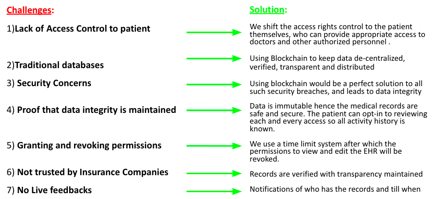
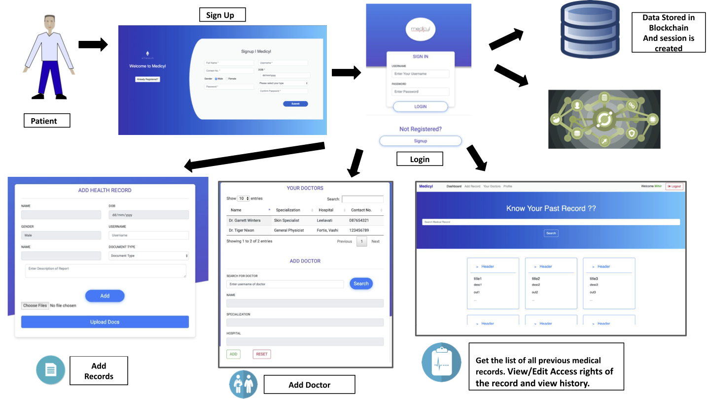
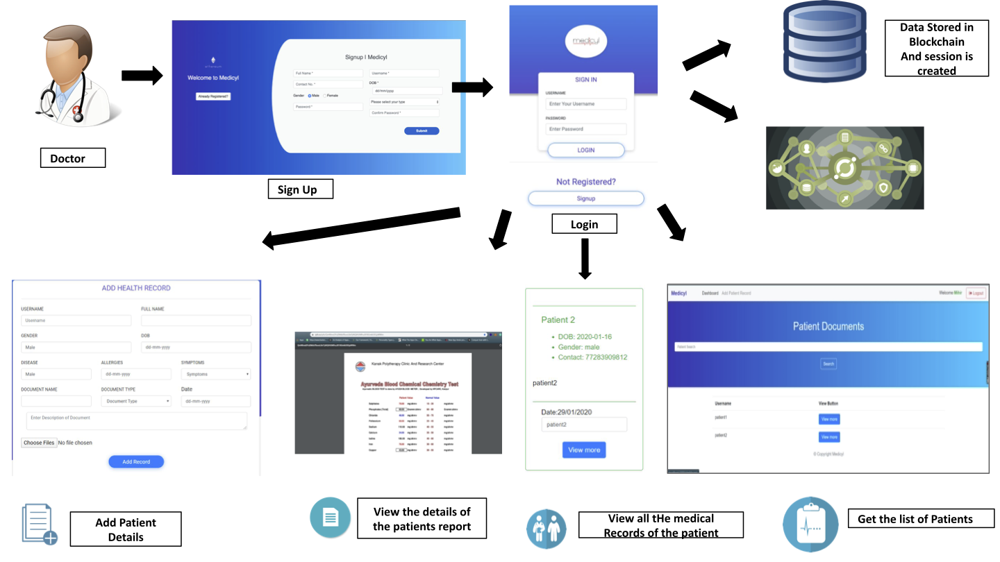

<p align="center">
  <a href="" rel="noopener">
 </a>
</p>
<h1 align="center">Medicyl</h1>

<div align="center">
  
[](https://opensource.org/licenses/MIT)

<h4>Medicyl is a blockchain-based <strong>Decentralized Medical Record Management System</strong>. The system focuses on storing the parients' electronic health records efficiently and securely, thus providing the people better access and control of their records, and enabling easy and secure sharing of the records with doctos, hospitals, or insurance companies.</h4>

</div>

-----------------------------------------
### Inspiration

* An Electronic Health Record (EHR) is a digital version of a patient's medical and treatment histories. There is no authentic report on the number of  patients whose EHRs have been stored so far and an acute lack of security and privacy. Hence, a modern implementation of EHR is required  in India.

* The idea that any person in India can go to any health service provider or pharmacy and have access to his or her health records in an electronic format is essential and can be life-saving in certain situations.

------------------------------------------
### Features

A mapping of the challenges faced by the traditional system and the features implemented in Medicyl to solve these challenges can be seen in the image bellow. 

<p align="center">
  <a href="" rel="noopener">
 </a>
</p>

------------------------------------------
### Demo

* View a detailed demonstration of Medicyl [here]().

* [Flow Diagrams](./assets/flows.pdf) with screenshots and features:
  
  * `Patient` 
  <p align="center">
    <a href="" rel="noopener">
   </a>
  </p>
  
  * `Doctor`
  <p align="center">
    <a href="" rel="noopener">
   </a>
  </p>

------------------------------------------
### Installation

* Step I: Clone the Repository
```sh
      $ git clone https://github.com/priyamshah112/Medicyl.git      
```
* Step II: Install the required packages
```sh
      # On the terminal move into Medicyl/medicyl directory
      $ cd Medicyl/medicyl
      $ npm install
```
* Step III: Run the application
```sh
      $ node app.js
```

------------------------------------------
### Authors

Mihir Gandhi - [mihir-m-gandhi](https://github.com/mihir-m-gandhi)

Priyam Shah- [priyamshah112](https://github.com/priyamshah112)

Mihir Shah - [mihir-ms](https://github.com/mihir-ms)

Alisasgar Haji - [Aliasgarhaji110](https://github.com/Aliasgarhaji110)

Kruti Shah - [kruti0201](https://github.com/kruti0201)

Vishal Kothari - [vishaljkk](https://github.com/vishaljkk)


------------------------------------------
### License
This project is licensed under the MIT - see the [LICENSE](./LICENSE) file for details.
